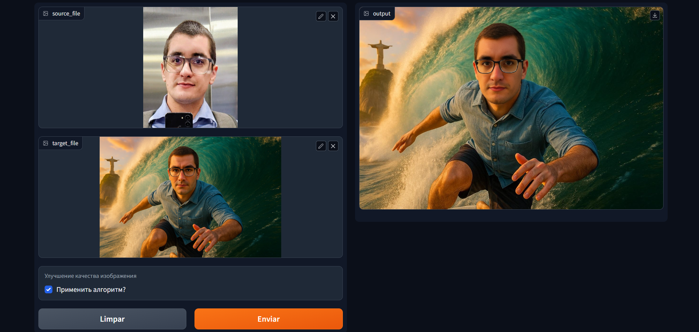

# AI Thumbnail Face Swap - Proof of Concept

**Objective:** Rapid prototype demonstrating face swapping for personalized YouTube thumbnails, addressing a challenge discussed with Vuestats.  
**Method:** Utilizes a pre-built Docker image (`registry.hf.space/musicutilist-face-integr:latest`) running a Gradio web UI for local face swap operations.

**Live Demo (Screencast):** [Watch the Demo Video](./files/ViewStats%20-%20Video.mp4)

---

## Quick Look: Face Swap Examples

The Gradio UI in action: Source face (top left), Target/Base thumbnail (bottom left), Result (right).
*Face Enhancer option was **checked** for these examples.*

### Example 1



### Example 2


### Example 3


---

## Core Idea & Workflow

1. **Optimized Base Thumbnail Generation (Manual for PoC):**
    - **Concept:** To minimize face swap errors, the base thumbnail should ideally be AI-generated *already resembling the target user*.
    - **Method Used:** Generated base thumbnails (e.g., `files/thumbnail1.jpg`) using **ChatGPT GPT-4o**, providing my face photo as a reference along with text prompts.
2. **Source Face:**  
    - Use a clear photo of the face to be swapped in (e.g., `files/face.jpg`).
3. **Face Swap via Docker & Gradio UI:**
    - Run the `musicutilist-face-integr` Docker image locally.
    - Access the Gradio web UI at `http://localhost:7860`.
    - Upload the base thumbnail (to "target_file") and source face (to "source_file").
    - Check the "Face Enhancer" checkbox ("Применить алгоритм?").
    - Click "Enviar" (Submit) to process.
    - Download the resulting swapped image from the output section.

---

## Technologies

- **Face Swap Tool:** Docker Image `registry.hf.space/musicutilist-face-integr:latest` (includes `roop`, Python, Gradio)
- **Base Image Generation:** ChatGPT GPT-4o (with face reference + text prompts)
- **Interaction:** Gradio Web UI

---

## Replicate Locally

### Prerequisites

- Docker installed & running ([docker.com](https://www.docker.com/products/docker-desktop/))
- Containerd engine enabled in Docker (if required by the image)
- Example images from `files/` directory in this repo (or your own)
- Helper scripts (`script.sh`, `run_docker.bat`) from this repo (optional)

### 1. Get Project Files (Optional)

Clone this repository to get all project files, including example images in `files/` and helper scripts:
```bash
git clone https://github.com/tsnthiago/viewstats-thumb.git
cd viewstats-thumb
```
(Alternatively, manually download the `files/` directory and scripts.)

### 2. Run the Docker Container

Navigate to the project directory and use the appropriate method:

*   **Linux/macOS/WSL:**
    ```bash
    chmod +x script.sh # If needed
    ./script.sh
    ```
*   **Windows (CMD/PowerShell):**
    ```cmd
    run_docker.bat
    ```
*   **Direct Docker Command:**
    ```bash
    docker run -it -p 7860:7860 --platform=linux/amd64 \
        registry.hf.space/musicutilist-face-integr:latest python app.py
    ```

### 3. Access and Use the Gradio Web UI

1.  Open a browser to `http://localhost:7860`.
2.  Upload your base thumbnail to the first field and source face to the second.
3.  Check "Применить алгоритм?" (Face Enhancer).
4.  Click "Enviar" (Submit).
5.  Download the result.

---

## Challenges & Limitations

- Base image generation is currently manual.
- Relies on an external Docker image.
- Gradio UI is for demonstration, not a production frontend.
- Programmatic integration requires using `gradio_client` or API reverse-engineering.

---

## Next Steps

- Automate base image generation (e.g., via OpenAI or Gemini API).
- Develop a wrapper API (Flask/FastAPI) for easier integration.
- Create a custom, branded frontend.
- Explore alternative face swapping models.

---

## Author
*   Thiago Nobrega
*   GitHub: [https://github.com/tsnthiago](https://github.com/tsnthiago)
*   LinkedIn: [https://www.linkedin.com/in/thiago-nobrega/](https://www.linkedin.com/in/thiago-nobrega/)
